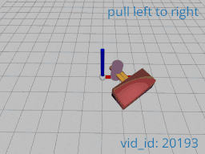
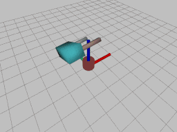
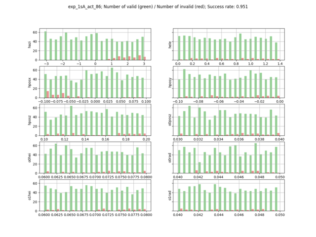

```diff
@@ Warning: The code in this repository is under construction. For the best exprience, please, try it later (in few days). @@
```

# About
This repository contains code for the CoRL 2020 submission titled **Learning Object Manipulation Skills via Approximate State Estimation from Real Videos**.
In case of any question contact us at *vladimir.petrik@cvut.cz* or *makarand.tapaswi@inria.fr*.

Additional data:
[Supplementary materials](https://data.ciirc.cvut.cz/public/projects/2020Real2Sim/), 
[YouTube overview video](https://youtu.be/0bhO3KCKVa8), 
[Paper PDF](https://drive.google.com/file/d/1DuHan9oZXznDnXiCP7J6ogWn8FMAAkIJ/view),
[arXiv](https://arxiv.org/abs/2011.06813).

Citation:
```bibtex
TBD.
```

# Code
The code is divided into a few main parts: 
- estimating/optimizing course states from a video,
- reinforcement learning of the control policies,
- benchmarking.

First part has its own installation instruction (separate conda env.), requires GPU, and uses [neural renderer](https://github.com/hiroharu-kato/neural_renderer).
RL and benchmarking parts share the same conda environment and use [rlpyt](https://github.com/astooke/rlpyt) for RL and [PyPhysX](https://github.com/petrikvladimir/pyphysx/) for simulation.
To simplify the experimentation, we provide you computed data for each step, so if you are interesting in RL part only you can download the extracted states as described below.

## Estimating states from video 

We use 6 videos each for 9 actions from the [Something-Something-v2 dataset](https://20bn.com/datasets/something-something).
Please download the data from the original link above.
Video and action ids are indicated in the code repositories.

### Structure
- `utils`: contains some utility functions
- `labels`: contains ground-truth annotations for action phase and [Something-Else annotations](https://github.com/joaanna/something_else)
- `preprocessing`: contains scripts that parse the video to create binary hand and object segmentation masks
- `real2sim`: contains classes and scripts for performing Real2Sim coarse state estimation via optimization

### Installation

### Required data

TBD: link to extracted segmentation masks, 
We also share video segmentation masks required as part of the perceptual losses from the neural renderer (results can be replicated without original videos).

### Optimization

## Reinforcement learning of control policies

### Installation
```shell script
conda env create -f install_real2sim_rl.yml
conda activate real2sim_rl

export PYTHONPATH="${PYTHONPATH}:`pwd`"  #run in the repo root
```

### Required data
Either run states estimation from the previous section, or download and extract states from TBD into the folder *data/states/*.
Once this is done, you can visualize states using:
```shell script
python simulation/scripts/visualize_states.py data/states/1sA
```
which will open 3D viewer and shows states one by one. 
No physics simulation is performed in this visualization.
Example of visualization:

 

### Training the policy
The following command will train policy for action id 86 (*pull left to right*) on states *1sA*.
On standard 4 cores laptop without gpu it takes about 3 hours to finish. 
You can track learning progress in tensorboard.

```shell script
# add -cuda_id 0 if you have cuda installed
python policy_learning/manipulation_learning.py -log_dir data/policies -name exp_1sA_act_86 --linear_lr -states_folder data/states/1sA -angle_bound_scale 0.01 --without_object_obs -seed 0
```
See folder *policy_learning/scripts/* for a collection of bash scripts we used for training policies which performance was reported in the paper.
These bash scripts just call *manipulation_learning.py* script with different parameters to train policies e.g. with different domain randomization or on different states.

### Visualization of trained policy

Use policy trained in the previous step.
```shell script
python policy_learning/manipulation_learning.py -log_dir data/policies -name exp_1sA_act_86 -states_folder data/states/1sA --without_object_obs --greedy_eval --render --realtime
```
You should see:

 


## Benchmarking
For benchmarking, install and activate conda environment from RL section:
```shell script
conda activate real2sim_rl
``` 
Benchmarking of policies is divided into two steps: (i) extracting trajectories by applying policy in simulation and (ii) evaluating trajectories by our proposed metrics.
To extract trajectories for trained policy do:
```shell script
python benchmarking/extract_benchmark_trajectories.py data/benchmark_specification/benchmark_easy.csv data/benchmark/exp_1sA_act_86 -log_dir data/policies -name exp_1sA_act_86 --without_object_obs
```
You will see progress bar that indicate evaluation of 1000 samples from easy benchmark specification.
Trajectories are stored in csv files in *benchmark/exp_1sA_act_86*.

These trajectories are then analysed in the second step by invoking command:
```shell script
python benchmarking/trajectories_analysis.py data/benchmark_specification/benchmark_easy.csv data/benchmark/exp_1sA_act_86
```
Besides success rate stored in *data/benchmark/performance.txt*, the script generates two plots useful for analysis, showing the marginal success rate histogram:

 
